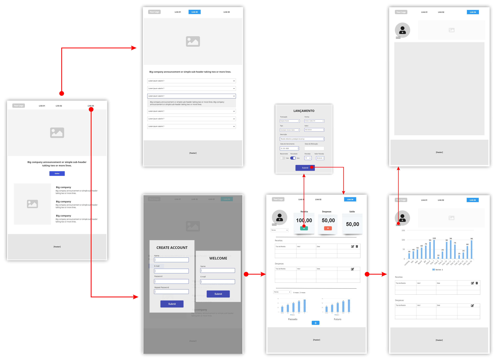

# Projeto de Interface

Pré-requisitos: <a href="02-Especificação do Projeto.md"> Documentação de Especificação</a>

Visão geral da interação do usuário pelas telas do sistema e protótipo interativo das telas com as funcionalidades que fazem parte do sistema (wireframes).

 Apresente as principais interfaces da plataforma. Discuta como ela foi elaborada de forma a atender os requisitos funcionais, não funcionais e histórias de usuário abordados nas <a href="02-Especificação do Projeto.md"> Documentação de Especificação</a>.

## Diagrama de Fluxo

A equipe desenvolveu este Diagrama de Fluxo pensando em como será o fluxo de dados e em quais serão os processos pelos quais o usuário passará para utilizar a nossa aplicação. Debatemos algumas possibilidades durante o desenvolvimento e chegamos a esta foi a melhor delas até o momento.

### User Flow
Fluxo de usuário (User Flow), é uma técnica que permite ao desenvolvedor mapear todo fluxo de telas da aplicação. Essa técnica funciona para alinhar os caminhos e as possíveis ações que o usuário pode fazer junto com os membros de sua equipe.

## Wireframes

Conforme fluxo de telas do projeto, apresentado no item anterior, as telas do sistema são apresentadas em detalhes nos itens que se seguem. As telas do sistema apresentam uma estrutura comum que é apresentada na Figura acima. Nesta estrutura, existem 3 grandes blocos, descritos a seguir. São eles:

● Cabeçalho - local onde são dispostos elementos fixos de identidade (logo) e navegação principal do site (menu da aplicação);

● Conteúdo - apresenta o conteúdo da tela em questão;

● Rodapé - apresenta a síntese do site associados aos elementos presentes no sistema, auxiliando na navegação do usuário e ajuda-lo com informações de contato para a empresa.

### Tela - Home Page
.png)

### Tela - FAQ
.png)

### Tela - Cadastro | Login
.png)

### Tela - Usuário logado
.png)

### Tela - Usuário logado
.png)

### Tela - Usuário logado
.png)

-----------------------------------------------------------------------------------------------------------------------------------------------------------------------

<<<<< 03-Metodologia- https://github.com/ICEI-PUC-Minas-PMV-ADS/pmv-ads-2023-1-e2-proj-int-t7-your-money/blob/main/docs/03-Metodologia.md <<

>>> 05-Arquitetura da Solução- https://github.com/ICEI-PUC-Minas-PMV-ADS/pmv-ads-2023-1-e2-proj-int-t7-your-money/blob/main/docs/05-Arquitetura%20da%20Solu%C3%A7%C3%A3o.md >>>

